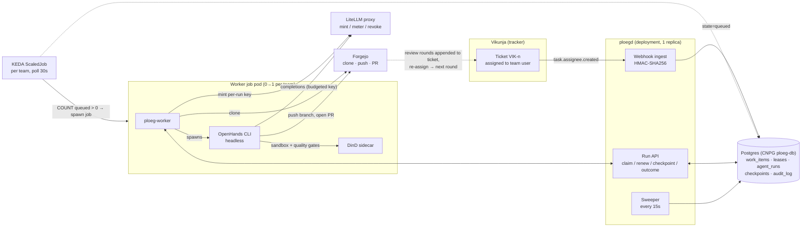
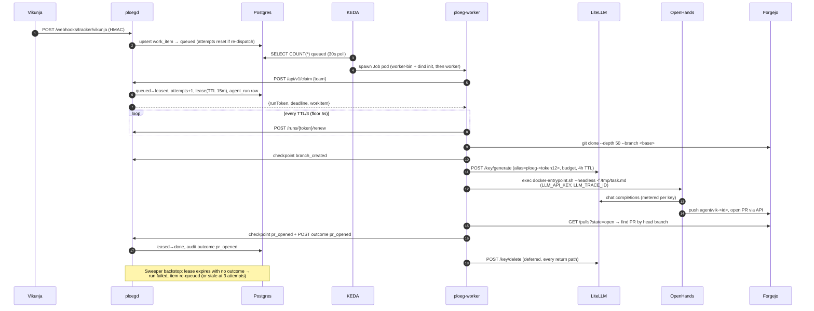
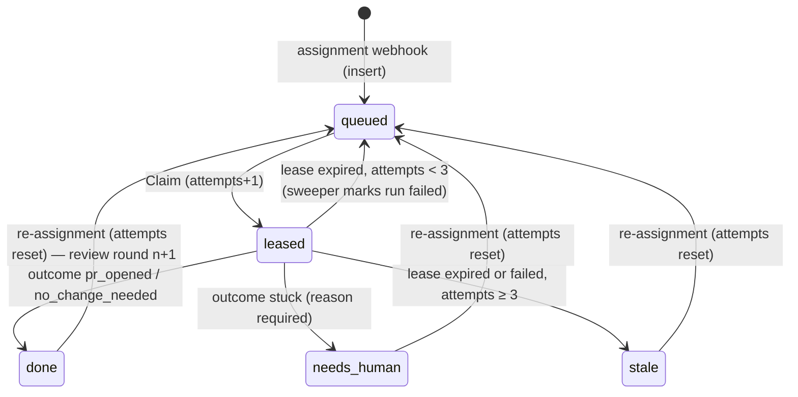
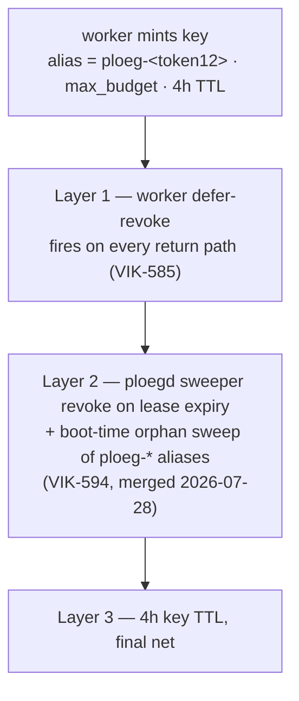
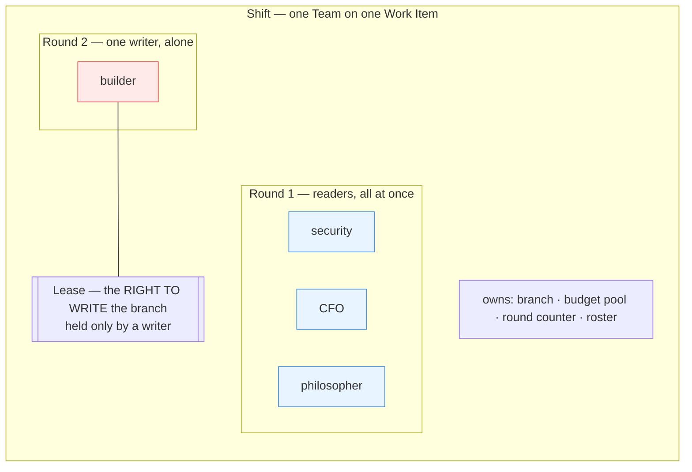
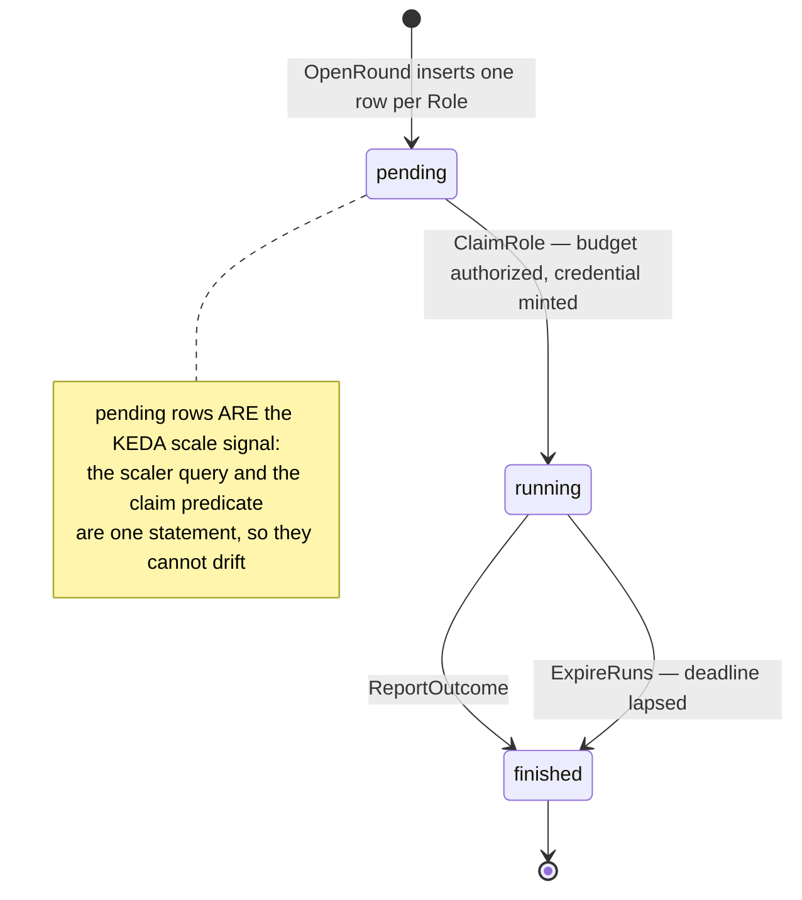
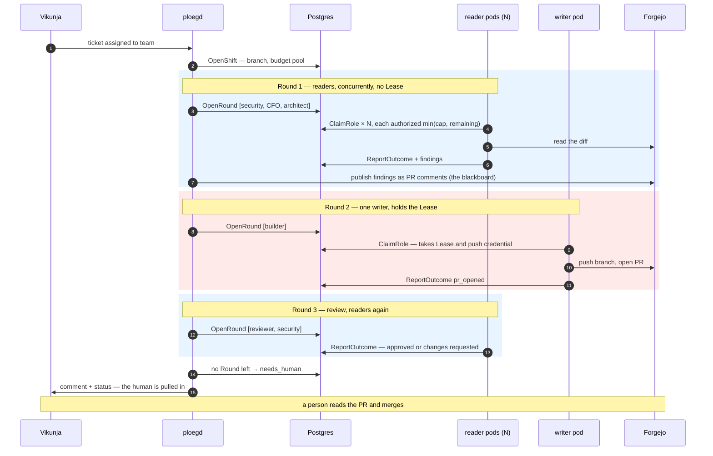
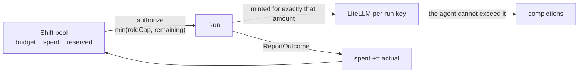
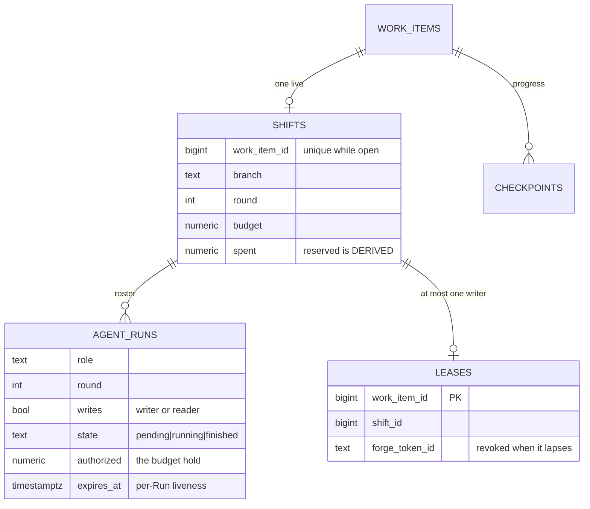

# Dark factory — current-state architecture

> **What this is.** How the dark factory *actually* functions as deployed on
> 2026-07-27 (`development`). [design.md](design.md) records intent; this file
> records reality, and [§9](#9-where-the-code-diverges-from-designmd) lists every
> known gap between the two. When you change the system, change this file.

The dark factory turns a **Vikunja ticket assignment into a reviewed Forgejo PR**
with no human in the execution loop. Ploeg (this repo) is the dispatch plane:
it owns ingest, queueing, leasing, budgets, and outcome bookkeeping. The LLM
work happens in ephemeral Kubernetes jobs running the `agent-runner` image
(built in `webgrip/infrastructure`), deployed and sized by
`webgrip/homelab-cluster`.

## 1. System context

The loop closes outside this repo: a reviewer (human or the Agora review loop)
reads the PR, appends a review round to the ticket body, and re-assigns the
team user — which re-queues the item ([VIK-588 semantics](#4-work-item-state-machine))
and sends the agent back to the same branch for the next round.

## 2. One run, end to end

**Timing (measured 2026-07-27).** Pod creation → agent working was ~2m45s
before that day's fixes: dockerd was ready ~13s after the dind sidecar started
and was *never* the bottleneck — the cost was `openhands --version` in the
runner entrypoint cold-importing the CLI tree (2m20s at the then 500m CPU cap).
Since agent-runner **1.0.3** (banner baked at image build) and the worker CPU
bump to 1 full core, expect ~30–40s on a cold node, less on a warm one.

## 3. The worker job pod

One pod per run, one run per pod (`backoffLimit: 0` — Ploeg owns retries, so
every pod is one auditable attempt). Defined in
[ops/helm/ploeg/templates/scaledjob.yaml](../ops/helm/ploeg/templates/scaledjob.yaml).

| Container | Kind | Purpose |
|---|---|---|
| `worker-bin` | init | Distroless self-copy of `ploeg-worker` into a shared emptyDir (`ploeg-worker install`) — no shell exists to `cp` |
| `dind` | init, `restartPolicy: Always` (native sidecar) | Privileged Docker daemon; startup probe on :2376 gates the worker's start. Hosts the harness sandbox and the quality gates, which run in **CI's own images** so gates match CI exactly. Rendered only when the team's harness needs Docker (`harness.dind`, default true) |
| `worker` | main | `ploeg-worker` binary running inside the team's harness image (default: `agent-runner`): claim → clone → mint → harness adapter (`PLOEG_HARNESS`) → PR detect → report |

The pod template is one shared Helm helper (`ploeg.workerPodTemplate`) used
by both executors (`executor.type: keda | cronjob`); a team's `harness`
block swaps image, adapter, and dind without touching anything else.

Load-bearing pod facts:

- **Guaranteed QoS everywhere** (requests == limits on every container):
  burstable pods live in the cgroup tree the Talos OOMController sweeps under
  memory pressure — that killed runs 9 and 10 on 2026-07-25 (ADR-0049). Under
  scarcity, runs now queue as `Pending` (no lease, no attempt, no spend)
  instead of starting into a death zone.
- `ci-shared` emptyDir is mounted at the **same absolute path** in worker and
  dind so `docker run -v` bind mounts resolve on the daemon's filesystem.
- The pod has **zero Kubernetes API authority** (`automountServiceAccountToken:
  false`); the LLM-driven process can touch Docker-in-pod, Forgejo (as
  `agent-builder`), and its budgeted LiteLLM key — nothing else.
- KEDA specifics: `scalingStrategy: accurate` (KEDA #6416 over-scaling bug),
  `rollout: gradual` (spec updates never kill in-flight runs), scale query
  served index-only by the `work_items_claimable` partial index.

## 4. Work item state machine

States and transitions as implemented in `pkg/store` + `pkg/work`
(the SQL performs transitions directly; `work.CanTransition` exists but is not
enforced — see §9):

- **Claim** is `FOR UPDATE SKIP LOCKED` on the oldest highest-priority queued
  item; a `leases` row (PK = work_item_id → max one live lease per item) and an
  `agent_runs` row are created in the same transaction.
- **Renewal** is worker-driven at TTL/3; a 404 on renew or three consecutive
  renew errors cancels the run in-flight (lease lost ⇒ someone else may claim).
- **The sweeper is the crash detector.** There is no job watcher: a worker that
  dies hard simply stops renewing, the lease row expires, and the 15s sweep
  marks the run `failed` and re-queues (or stales) the item.
- **Re-dispatch = assignment.** The only path back from `done`/`stale`/
  `needs_human` is a fresh `task.assignee.created` webhook (VIK-588); it also
  resets `attempts`. There is no operator requeue endpoint.
- Every mutation writes `audit_log` in the same transaction
  (`work_item.queued`, `lease.acquired`, `outcome.*`, `lease.expired`, …).

**Outcomes.** The worker only ever reports `pr_opened`, `no_change_needed`, or
`stuck`; `failed` is produced exclusively by the sweeper on lease expiry.
`stuck` → `needs_human` (no retry), `failed` → requeue (attempt-capped).

> **Read that last clause per dispatch shape.** On the pre-Shift path, and for
> a uniform (synthesized) Shift, `failed` requeues the item attempt-capped.
> Inside a PLANNED Shift a failed *writing* Run re-opens its own Round instead,
> capped at `MaxRunAttempts`, and parks the Shift at `needs_human` when that
> runs out ([ADR-0019](adrs/0019-a-failed-writing-run-reopens-its-round.md)). A
> failed *reading* Run costs an opinion and the Round advances without it.

## 5. Money: the per-run LiteLLM key

Every run gets its own budgeted, TTL'd key whose **alias is the trace id** —
`ploeg-<first 12 hex of run token>`. That string is load-bearing: it is the
LiteLLM `key_alias`, the `LLM_TRACE_ID` env, and the `Agent-Trace-Id` commit
trailer, and Grafana joins spend ↔ run ↔ ticket on it. Do not change its shape.

The worker owns mint + revoke; the runner entrypoint sees a caller-supplied
`LLM_API_KEY` and skips its own minting (its log line says so — that is
correct, not a bug). A SIGKILLed worker skips its defer — the gap VIK-594's
sweeper-side revoke (merged 2026-07-28, `cmd/ploegd/sweep.go`) now closes: a
hard-killed run's key survives only until its lease expires (≤15 min) and the
next 15 s sweep revokes it, instead of until the 4 h TTL. The alert
`slo-ploeg-run-key-leak` covers that remaining window.

## 6. The task contract

`worker.ComposePrompt` renders the prompt every adapter delivers in its own
native format (the `openhands` adapter writes it to `/tmp/task.md`; `exec`
also writes a `taskspec.json` per [contracts/](contracts/); `claude-code`
passes it inline): the ticket title + description verbatim,
then a delivery contract — work on branch `agent/vik-<id>` from the configured
base, never commit to base, run the quality gates via `docker run` against CI's
images before opening a PR, end every commit with `VIK-<id>` and
`Agent-Trace-Id:` trailers, open (never merge) a PR via the Forgejo API. Review
rounds appended to the ticket body ride along verbatim on re-dispatch, which is
how "continue on the same branch per review round N" reaches the agent.

The agent-runner image bakes the OpenHands CLI (pinned, never `@next`), a
docker CLI (daemon = the dind sidecar), node/moon/openspec tooling, and a core
skills loadout; per-ticket extras come from `OPENHANDS_SKILLS_PROFILE`. Two
startup taxes are patched out at image build: the CLI's forced public-skills
GitHub sync (no egress → 5 min of timeouts) and litellm's remote model-cost-map
fetch (VIK-590).

## 7. HTTP surface of ploegd

| Route | Purpose |
|---|---|
| `POST /webhooks/tracker/vikunja` | HMAC-verified ingest; only `task.assignee.created` does anything |
| `POST /webhooks/forge/{provider}` | HMAC-verified forge ingest; deduplicated on the delivery id, audited, not yet acted on |
| `POST /api/v1/claim` | Lease next queued item for a team, or — with `role` — the next pending Run of that Role (204 = empty-handed, worker exits 0; also an exhausted Shift pool) |
| `POST /api/v1/runs/{token}/renew` | Extend lease (404 ⇒ worker aborts) |
| `POST /api/v1/runs/{token}/checkpoint` | Record `branch_created` / `pr_opened` |
| `POST /api/v1/runs/{token}/outcome` | Terminal report (full `OutcomeReport`: checkpoint + usage ride inline); `stuck` requires a reason |
| `GET /api/v1/queue/depth?team=&role=` | Executor scale signal over HTTP (same predicate as the KEDA scaler query; with a role, pending Runs for that `(team, role)`) |
| `GET /api/v1/queue/{team}` | Operator snapshot |
| `GET /healthz` · `GET /readyz` | Liveness / DB-ping readiness |

The 48-hex run token in the path is the **only** credential on the run API —
unguessable, but any holder can renew/checkpoint/report for that run.

## 8. Teams and deployment knobs

A team = a Helm values entry: name, model, per-run budget,
`maxReplicaCount` (currently 1), and optionally a `harness` block
(adapter name, agent image, entrypoint/args, dind) overriding the global
`executor.harness` defaults — the single axis of variation for swapping
harness and image per team.

**The repository is not a team property** (R11, [ADR-0014](adrs/0014-work-target-is-a-work-item-attribute.md)):
it belongs to the work item, resolved at ingest from the item's tracker scope
via ploegd's `PLOEG_TARGET_MAP` and delivered on the claim. A team may still
pin `repoOwner`/`repoName`/`baseBranch` as a *fallback* while the rollout
completes — no longer required by the schema — and `targetSource: env` pins one
team to that fallback regardless of what the claim says. See
[§9.12](#9-where-the-code-diverges-from-designmd) for what is still open.

A team may also carry a **plan**: an ordered list of Rounds, each naming Roles
with `writes`, a per-Run `cap`, and optionally its own model, image and harness
(`executor.teams[].plan[]`, serialised to ploegd as `PLOEG_TEAM_PLANS`). A
planned team renders one workload per `(team, role)` rather than one per team,
which is what makes "different agents, different harnesses, different images"
literally true — pod shape is fixed at render time. `maxFixRounds` bounds the
review loop (ADR-0017). A team with no plan gets a synthesized one-writer Shift
unless `PLOEG_SHIFTS_UNIFORM=false`.

Assignee-username → team routing via
`PLOEG_TEAM_MAP` ("assign ticket to user `silver` = dispatch team silver");
unmapped assignees fall to `PLOEG_DEFAULT_TEAM`. Live sizing, image pins, and
team roster are set in `homelab-cluster`'s HelmRelease, which overrides this
chart's defaults — check there first when debugging what's actually running.

## 9. Where the code diverges from design.md

Known gaps between [design.md](design.md) / [domain/model.yaml](domain/model.yaml)
and the implementation (1–11 verified 2026-07-27; 12–17 added 2026-07-29).
Aspirational ≠ implemented:

1. **PR follow-up ingestion** (design §3, R9): **partly closed 2026-07-29.**
   `pkg/provider/forgejo` is the first `ForgeProvider` (Name, Comment,
   ParseWebhook), and `POST /webhooks/forge/{provider}` verifies, deduplicates
   (migration 0011) and audits inbound events. Still open: nothing ACTS on
   them — `origin=follow_up` is still never produced. Routing a submitted
   review into a re-mandate needs the branch → Work Item reverse lookup that
   neutral branch naming (backlog #107) owes it, and there are now two paths
   meaning "keep going" (a reviewer's verdict, ADR-0017, and a human's review)
   which are deliberately not yet reconciled. **The route is also unreachable
   in the live cluster**: forgejo→ploeg is blocked in both directions
   (`kubernetes/apps/ploeg/.../networkpolicy.yaml` has no forgejo ingress rule,
   and forgejo's own egress excludes the pod/service CIDRs) — ops work, not a
   code change.
2. **Harness contract** (design §5): **closed 2026-07-28.** `pkg/harness`
   now carries the live seam: `TaskSpec`/`OutcomeReport` are the adapter I/O
   (published schemas in [contracts/](contracts/), backlog #59), and
   `harness.Adapter` wraps concrete harnesses — `openhands` (default),
   `exec` (generic binary), `claude-code` (#62), `acp` (#64) — selected per
   team via `PLOEG_HARNESS`. Outcome inference stays orchestrator-owned (the
   PR poll is ground truth) for the spawn-and-wait adapters; the `acp` adapter
   supplies structured stop reasons and defers to them.

   > **Naming hazard, and it catches everyone.** `acp` here is Zed's Agent
   > **Client** Protocol — editor ↔ local coding agent over stdio JSON-RPC,
   > wire version 1, co-maintained with JetBrains. It is **not** IBM's Agent
   > **Communication** Protocol, which merged into A2A in August 2025 and is
   > archived. Different layer, different transport, different problem; they
   > share three letters and nothing else. See
   > [ADR-0007](adrs/0007-a2a-adopt-nothing-watchlist-a-facade.md).
3. **"Watcher records failed on exit-without-report"**: no watcher exists;
   the DB lease sweeper is the crash detector.
4. **Teams with roles/strategies**: **closed 2026-07-29.** `pkg/shiftengine`
   opens a Shift when an item is queued, advances a Round when every Run in it
   has finished, and closes on plan exhaustion, a stuck Outcome or a dry pool —
   from the ingest/outcome fast path and repaired by the sweeper (R2). A Team
   plan (`executor.teams[].plan[]` → `PLOEG_TEAM_PLANS`) names Rounds and
   Roles; the chart renders one workload per `(team, role)` with its own image,
   harness, model and dind setting. `PLOEG_SHIFTS_UNIFORM` (default on) gives a
   plan-less team a synthesized one-writer Shift, so every item has one — and
   settles on the run's Outcome rather than `needs_human`, which keeps that a
   bookkeeping change. There is still no `teams` table: a team remains Helm
   values.
5. **Checkpoint-driven resume**: checkpoints are written, never read; every
   run starts fresh.
6. **Tracker write-backs**: **closed 2026-07-29.** Vikunja `FetchItem`,
   `Comment` (PUT, not POST — see [ops/board.md](ops/board.md)) and
   `SetStatus` are real, and a closing Shift comments the PR link and asks a
   person to merge. They are opt-in by credential: without
   `PLOEG_VIKUNJA_URL`/`_TOKEN` the provider keeps its logging no-op, so a
   deployment with no tracker credential still finishes runs — it just does
   not update the board. `SetStatus` writes only `done`; `needs_human` has no
   Vikunja column, and inventing a label mapping would put a Ploeg concept in
   the provider (R7).
7. **`ingested` state**: items are inserted directly as `queued`; `ingested`
   effectively never persists.
8. **`needs_human`/`stale` exits**: only re-assignment implements them; the
   legal-transition table in `pkg/work/state.go` is not enforced by the store.
9. **stuck vs failed semantics inverted for infra errors**: **partly closed.**
   The `acp` adapter classifies at the source — a missing binary, a failed
   `initialize` or a rejected protocol version become `failed`/`infra_node`,
   and an auth or quota failure `failed`/`infra_llm`, both retryable rather
   than parked. `pkg/worker`'s heuristics defer to an adapter-set
   `failureReason`, and `pkg/httpapi` now rejects one outside the taxonomy
   rather than storing it verbatim. Still open for the spawn-and-wait
   adapters: `openhands` and `exec` infer from exit codes and log tails, so a
   clone or mint failure under those harnesses is still parked.
10. **Unassignment** (`task.assignee.deleted`) is parsed and dropped — no run
    cancel or lease release (backlog #8).
11. **No metrics**: no OTel/Prometheus in Go; observability is structured logs
    plus the `key_alias` join in Grafana (external dashboards in homelab-cluster).
    This is a gap for *live* observability only — do not read it as "there is no
    timing data". `agent_runs.started_at`/`finished_at` are exact per Run and
    per Round after the fact, and the alias itself is derivable in SQL
    (`'ploeg-' || left(run_token,12)`), so post-hoc latency and cost analysis
    needs no new instrumentation.
12. **Team names the repository** [status: unchanged by the Shift work — the
    fallback window below is still open] (design §3, Team entity in `domain/model.yaml`): the
    Team entity's attributes are exactly name, roles, strategy, budget — no
    repo. The chart binds one anyway: `ops/helm/ploeg/values.yaml` team entries
    carry `repoOwner`/`repoName`/`baseBranch`, and `values.schema.json:34` makes
    `repoOwner`/`repoName` **required**; `cmd/ploeg-worker/main.go:70-74`
    `requireEnv`s `REPO_OWNER`/`REPO_NAME` before the worker claims anything.
    The model's only repository is `TaskSpec.repo_url`
    (Task Spec entity, same file), which states no derivation. Cost: onboarding
    a repo needs a new team + KEDA ScaledJob + tracker bot user even when model,
    budget and harness are identical. Decision to decouple:
    [adrs/0014-work-target-is-a-work-item-attribute.md](adrs/0014-work-target-is-a-work-item-attribute.md).
    **Partly closed 2026-07-29**: a Work Item now carries its own Target
    (`pkg/work.Target`, migration 0007), the claim delivers it, the worker
    prefers it (`pkg/worker/target.go`), and the chart no longer *requires* a
    per-team repo. Still open until the rollout completes: teams may still pin
    a fallback repo, and no live team resolves a Target yet — the map
    (`PLOEG_TARGET_MAP`) is empty, so every run still uses its env repo.
    R11's "a Work Item without a resolved Work Target is not claimable" is
    therefore **not enforced** yet: during the fallback window an unresolved
    item claims fine and the worker uses its env repo. Enforcement lands when
    the last team drops its fallback.
13. **The SPI carries a core concept** (R7): `provider.TrackerEvent.Team`
    (`pkg/provider/provider.go:27`) puts a Ploeg-domain routing *result* in the
    provider SPI, and the Vikunja adapter produces it from `PLOEG_TEAM_MAP` —
    the exact shape R7 forbids ("core semantics must never encode a
    provider-specific workaround"). Decision:
    [adrs/0015-routing-is-core-policy-over-provider-opaque-scopes.md](adrs/0015-routing-is-core-policy-over-provider-opaque-scopes.md).
14. **The native routing scope is discarded at the parse boundary**:
    `pkg/provider/vikunja/vikunja.go:38-51` unmarshals only `event_name`,
    `data.task.{id,title,description,priority}` and `data.assignee.username`.
    Vikunja *does* send `project_id`; `encoding/json` silently drops it (zero
    `project_id` references repo-wide). Per [ops/board.md](ops/board.md)
    ("Dispatch topology — the trap") every team's webhook and team-user share
    live on **Ploeg Test (project 11)**, not the planning board, so all teams
    ingest one project and the repository is effectively chosen by which
    persona gets assigned. **Closed 2026-07-29**: the adapter now emits the
    project as an opaque `provider.Scope` and the core maps it to a Target; the
    one-project topology is why the map's transitional key is `<scope>/<team>`
    rather than scope alone.
15. **Forge is a global singleton**: one `FORGEJO_URL` + one
    `AGENT_BUILDER_TOKEN` (`ops/helm/ploeg/templates/_helpers.tpl:142-148`) and
    a hardcoded `agent-builder` git identity (`pkg/worker/worker.go:118,125`).
    `provider.ForgeProvider` (`pkg/provider/provider.go:47-70`) has **zero**
    implementations while `pkg/worker/forge.go:22-55` hardcodes the Forgejo REST
    dialect. Decision:
    [adrs/0016-forge-registry-and-per-run-repo-scoped-credentials.md](adrs/0016-forge-registry-and-per-run-repo-scoped-credentials.md).
16. **`agent/vik-<id>` embeds a vendor token and is not unique per target**:
    `pkg/worker/worker.go:81` builds the branch as `"agent/vik-" +
    item.ExternalID`. `vik` is a Vikunja token sitting in core semantics (R7),
    and the same name recurs across repositories — which is why R9 ("Follow-Ups
    are routed to the Team owning the source branch") has no implementable
    lookup key today.
17. **Spend attribution is only groupable by team**: `agent_runs` carries `team`
    but no target, and with the repo fixed per team (12) cost rolls up by
    capability tier only — never per product or repository. Since 2026-07-29 the
    target is on `work_items` and in the `lease.acquired` audit row, so a
    per-repo rollup is a join away; `agent_runs` still carries no target column.
18. **A reading Run could not return findings on every harness**: **closed
    2026-08-08.** `ComposePrompt` tells every reading Run to write its review to
    `$PLOEG_OUTCOME_FILE`, but only `openhands` and `exec` set it —
    `claude-code` never exported the variable and `acp` had no drop box at all,
    so on those harnesses `agent_runs.findings`/`verdict` stayed empty,
    `requestsChanges` was always false, and **ADR-0017's review loop was inert**:
    every Shift closed `review_approved` whatever the reviewer found. The drop
    box is now one implementation in `pkg/harness` used by all four adapters
    ([ADR-0018](adrs/0018-the-outcome-drop-box-is-every-harnesss-return-path.md)),
    pinned by `harnesstest`'s `ReadingRunFindingsSurviveTheAdapter`. Fixed
    alongside it: `resolveOutcome`'s structured-report arm returned no `Links`,
    so a reader that wrote a drop box lost the PR URL and a review-only Shift
    published its findings nowhere. Still open, and why the two are separate
    facts: with no writing Run to carry the link, a review-only Shift has no PR
    for `publishRound` to comment on at all — a review-only plan grades review
    *content*, never review *delivery*.
19. **A failed writing Run did not stop the plan**: **closed 2026-08-08**,
    [ADR-0019](adrs/0019-a-failed-writing-run-reopens-its-round.md).
    `shiftengine.evaluate` froze the plan on a `stuck` Outcome and had no case
    for `failed`. A Run the sweeper reclaimed is, to `RoundComplete`, simply
    finished — so the Round completed and the next one opened over work that
    was never done: the reviewer reviewed a branch that had never been written,
    approved it, and the Shift closed **`review_approved` with no pull
    request**, while the tracker comment correctly said Ploeg had stopped
    without opening one.

    The shift-orchestration spec's "a swept Run does not block its Round
    forever" was reasoned about READERS, and for a reader it still holds. The
    distinction it was missing is `writes`. A failed writing Role now re-opens
    the round the Shift is already on (`store.ReopenRound` — in place, because
    `shifts.round` doubles as the plan index and a fresh Round would silently
    skip the next planned one), capped at `store.MaxRunAttempts`, then parks at
    `needs_human` with close reason `writing_run_failed_repeatedly`.

    Found by the bench's crash drill, which SIGKILLs the worker so the lease
    genuinely lapses — sleeping does not, because the worker renews on its own
    goroutine while the agent works. `MaxRunAttempts` is deliberately separate
    from `MaxAttempts`: `work_items.attempts` increments per role claim, so it
    stopped meaning "attempts at this work" the day Shifts landed.

## 10. Shifts: many personas on one item

> **Build status.** This documents the architecture decided in
> [ADR-0010](adrs/0010-shift-owns-the-item-lease-owns-the-branch.md),
> [0011](adrs/0011-the-pull-request-is-the-blackboard.md),
> [0012](adrs/0012-two-level-budgets-authorized-and-settled.md) and
> [0013](adrs/0013-push-rights-are-minted-per-run.md). **The store layer is
> built and tested; nothing drives it yet** — see [§10.6](#106-build-status).
> Everything in §§1–9 above is what actually runs today.

### 10.1 The three jobs a Lease used to do

With one pod per item, mutual exclusion, liveness and accounting were
indistinguishable — one `leases` row did all three. Several pods on one item
pulls them apart, and each attaches to a different lifetime.

| Concern | Attaches to | Why there |
| --- | --- | --- |
| "This Team is working this item" — branch, budget, roster, rounds | **Shift** | Spans every Run on the item |
| Exclusive right to **write** the branch | **Lease** | Only one writer may push at a time |
| Liveness, and the credential | **Run** | A Run is what dies, so a Run is what must expire |

The contended resource was never the ticket — it was the **branch**. Any number
of agents can read a diff at once; they cannot both push. And because most
personas only read and opine, exclusion is needed by a minority of Runs.

### 10.2 Rounds

A Round is a set of Runs that start together. Runs in one Round never observe
each other; every later Round sees everything earlier Rounds produced.

**A Round is either a fan-out of readers or exactly one writer, never both.**
That single rule is the whole of the concurrency control — readers hold no
Lease, so they have nothing to coordinate over. `OpenRound` refuses a malformed
Round rather than trusting callers with the rule everything rests on.

### 10.3 The full loop

Multiple agents make a change together, a review is kicked off, and a human is
pulled in to merge.

### 10.4 Money

Two limits of different kinds. A per-Run cap stops one agent looping; the Shift
pool stops the *item* costing more than it is worth. They do not sum.

`reserved` is **summed over running Runs**, never stored as a counter. A Run
that stops running stops holding money, so a missed release is impossible
rather than unlikely, and unspent allowance returns to the pool with nobody
having to put it back. Below a floor no Run is spawned at all — a gate outcome,
not a dispatched-then-failed Run.

### 10.5 Data model

### 10.6 Build status

| Component | State |
| --- | --- |
| Migration, Shift/Round/Run store, budgets, settlement, sweeper | **built** — 13 tests in `pkg/store/shift_test.go` |
| Harness plurality — ACP: Claude, Copilot, Codex, Cursor, opencode, Gemini… | **built** — `pkg/harness/adapters/acp` |
| ploegd orchestration: opening Shifts and Rounds, closing them | **not built** — nothing drives the diagrams above |
| Role-aware `TaskSpec` and prompt composition | **not built** |
| Forgejo `ForgeProvider` — PR comments, i.e. the blackboard | **not built** — interface defined, zero implementations |
| Vikunja write-backs — pulling the human in | **not built** — `Comment`/`SetStatus` are logging no-ops |
| Per-Run push credentials ([ADR-0013](adrs/0013-push-rights-are-minted-per-run.md)) | **not built** — every pod still shares one static token |
| Role-partitioned Helm workloads | **not built** |

## 11. Pointers

- Dispatch plane code: [cmd/ploegd](../cmd/ploegd) ·
  [cmd/ploeg-worker](../cmd/ploeg-worker) · [pkg/worker](../pkg/worker)
  (run orchestration) · [pkg/harness](../pkg/harness) (adapter seam +
  adapters) · [pkg/llmbroker](../pkg/llmbroker) (credential seam) ·
  [pkg/store](../pkg/store) · [pkg/httpapi](../pkg/httpapi) ·
  [pkg/provider](../pkg/provider) · [pkg/litellm](../pkg/litellm) ·
  [pkg/work](../pkg/work)
- Published contracts (schemas + executor SPI): [contracts/](contracts/)
- Chart: [ops/helm/ploeg](../ops/helm/ploeg) — live values in
  `webgrip/homelab-cluster` (`kubernetes/apps/ploeg/`)
- Runner image: `webgrip/infrastructure` → `ops/docker/agent-runner/`
- Design intent: [design.md](design.md) · domain language:
  [domain/](domain/) · roadmap: [backlog.md](backlog.md) · decision records:
  [adrs/](adrs/README.md)
