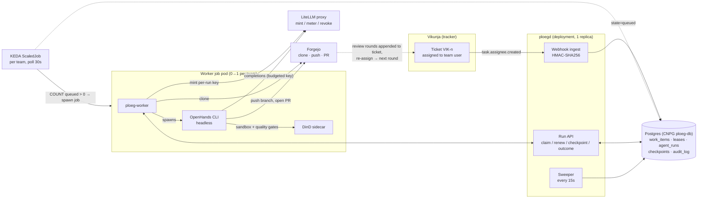
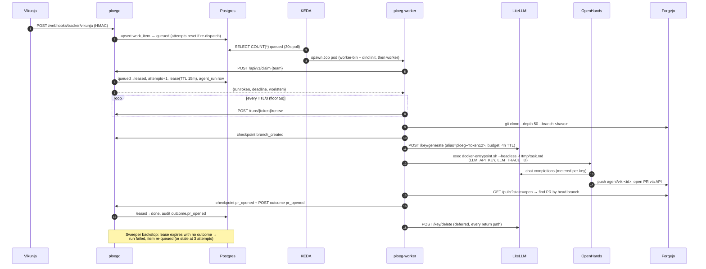
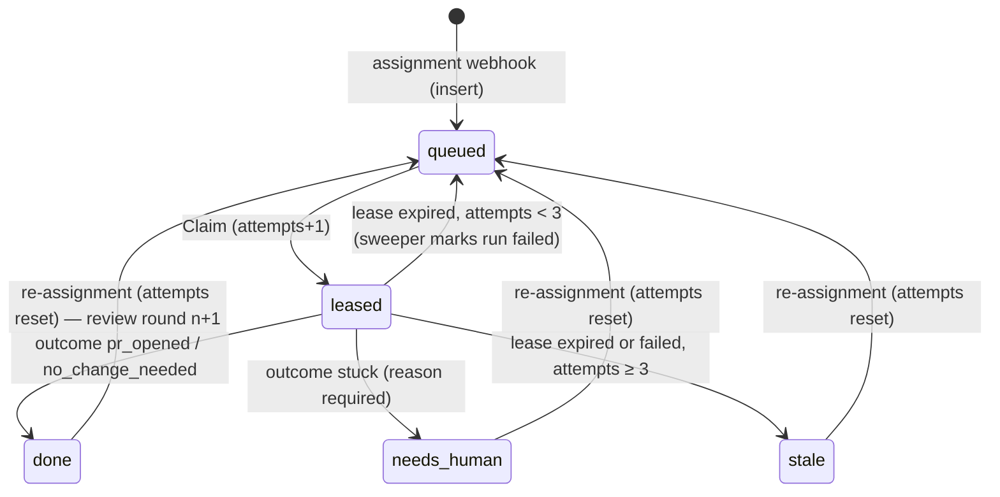
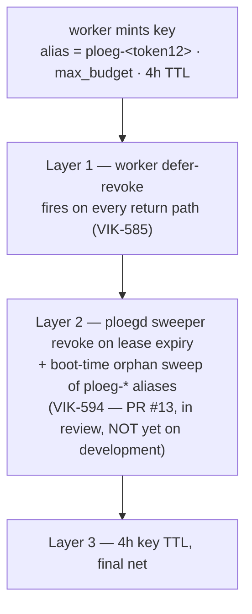

# Dark factory — current-state architecture

> **What this is.** How the dark factory *actually* functions as deployed on
> 2026-07-27 (`development`). [design.md](design.md) records intent; this file
> records reality, and [§9](#9-where-the-code-diverges-from-designmd) lists every
> known gap between the two. When you change the system, change this file.

The dark factory turns a **Vikunja ticket assignment into a reviewed Forgejo PR**
with no human in the execution loop. Ploeg (this repo) is the dispatch plane:
it owns ingest, queueing, leasing, budgets, and outcome bookkeeping. The LLM
work happens in ephemeral Kubernetes jobs running the `agent-runner` image
(built in `webgrip/infrastructure`), deployed and sized by
`webgrip/homelab-cluster`.

## 1. System context

The loop closes outside this repo: a reviewer (human or the Agora review loop)
reads the PR, appends a review round to the ticket body, and re-assigns the
team user — which re-queues the item ([VIK-588 semantics](#4-work-item-state-machine))
and sends the agent back to the same branch for the next round.

## 2. One run, end to end

**Timing (measured 2026-07-27).** Pod creation → agent working was ~2m45s
before that day's fixes: dockerd was ready ~13s after the dind sidecar started
and was *never* the bottleneck — the cost was `openhands --version` in the
runner entrypoint cold-importing the CLI tree (2m20s at the then 500m CPU cap).
Since agent-runner **1.0.3** (banner baked at image build) and the worker CPU
bump to 1 full core, expect ~30–40s on a cold node, less on a warm one.

## 3. The worker job pod

One pod per run, one run per pod (`backoffLimit: 0` — Ploeg owns retries, so
every pod is one auditable attempt). Defined in
[ops/helm/ploeg/templates/scaledjob.yaml](../ops/helm/ploeg/templates/scaledjob.yaml).

| Container | Kind | Purpose |
|---|---|---|
| `worker-bin` | init | Distroless self-copy of `ploeg-worker` into a shared emptyDir (`ploeg-worker install`) — no shell exists to `cp` |
| `dind` | init, `restartPolicy: Always` (native sidecar) | Privileged Docker daemon; startup probe on :2376 gates the worker's start. Hosts the OpenHands sandbox and the quality gates, which run in **CI's own images** so gates match CI exactly |
| `worker` | main | `ploeg-worker` binary running inside the `agent-runner` image: claim → clone → mint → OpenHands → PR detect → report |

Load-bearing pod facts:

- **Guaranteed QoS everywhere** (requests == limits on every container):
  burstable pods live in the cgroup tree the Talos OOMController sweeps under
  memory pressure — that killed runs 9 and 10 on 2026-07-25 (ADR-0049). Under
  scarcity, runs now queue as `Pending` (no lease, no attempt, no spend)
  instead of starting into a death zone.
- `ci-shared` emptyDir is mounted at the **same absolute path** in worker and
  dind so `docker run -v` bind mounts resolve on the daemon's filesystem.
- The pod has **zero Kubernetes API authority** (`automountServiceAccountToken:
  false`); the LLM-driven process can touch Docker-in-pod, Forgejo (as
  `agent-builder`), and its budgeted LiteLLM key — nothing else.
- KEDA specifics: `scalingStrategy: accurate` (KEDA #6416 over-scaling bug),
  `rollout: gradual` (spec updates never kill in-flight runs), scale query
  served index-only by the `work_items_claimable` partial index.

## 4. Work item state machine

States and transitions as implemented in `pkg/store` + `pkg/work`
(the SQL performs transitions directly; `work.CanTransition` exists but is not
enforced — see §9):

- **Claim** is `FOR UPDATE SKIP LOCKED` on the oldest highest-priority queued
  item; a `leases` row (PK = work_item_id → max one live lease per item) and an
  `agent_runs` row are created in the same transaction.
- **Renewal** is worker-driven at TTL/3; a 404 on renew or three consecutive
  renew errors cancels the run in-flight (lease lost ⇒ someone else may claim).
- **The sweeper is the crash detector.** There is no job watcher: a worker that
  dies hard simply stops renewing, the lease row expires, and the 15s sweep
  marks the run `failed` and re-queues (or stales) the item.
- **Re-dispatch = assignment.** The only path back from `done`/`stale`/
  `needs_human` is a fresh `task.assignee.created` webhook (VIK-588); it also
  resets `attempts`. There is no operator requeue endpoint.
- Every mutation writes `audit_log` in the same transaction
  (`work_item.queued`, `lease.acquired`, `outcome.*`, `lease.expired`, …).

**Outcomes.** The worker only ever reports `pr_opened`, `no_change_needed`, or
`stuck`; `failed` is produced exclusively by the sweeper on lease expiry.
`stuck` → `needs_human` (no retry), `failed` → requeue (attempt-capped).

## 5. Money: the per-run LiteLLM key

Every run gets its own budgeted, TTL'd key whose **alias is the trace id** —
`ploeg-<first 12 hex of run token>`. That string is load-bearing: it is the
LiteLLM `key_alias`, the `LLM_TRACE_ID` env, and the `Agent-Trace-Id` commit
trailer, and Grafana joins spend ↔ run ↔ ticket on it. Do not change its shape.

The worker owns mint + revoke; the runner entrypoint sees a caller-supplied
`LLM_API_KEY` and skips its own minting (its log line says so — that is
correct, not a bug). A SIGKILLed worker skips its defer, which is exactly the
gap VIK-594's sweeper-side revoke closes; until PR #13 merges, a hard-killed
run leaks its key until the TTL reaps it (alert `slo-ploeg-run-key-leak`).

## 6. The task contract

`composeTask` writes `/tmp/task.md`: the ticket title + description verbatim,
then a delivery contract — work on branch `agent/vik-<id>` from the configured
base, never commit to base, run the quality gates via `docker run` against CI's
images before opening a PR, end every commit with `VIK-<id>` and
`Agent-Trace-Id:` trailers, open (never merge) a PR via the Forgejo API. Review
rounds appended to the ticket body ride along verbatim on re-dispatch, which is
how "continue on the same branch per review round N" reaches the agent.

The agent-runner image bakes the OpenHands CLI (pinned, never `@next`), a
docker CLI (daemon = the dind sidecar), node/moon/openspec tooling, and a core
skills loadout; per-ticket extras come from `OPENHANDS_SKILLS_PROFILE`. Two
startup taxes are patched out at image build: the CLI's forced public-skills
GitHub sync (no egress → 5 min of timeouts) and litellm's remote model-cost-map
fetch (VIK-590).

## 7. HTTP surface of ploegd

| Route | Purpose |
|---|---|
| `POST /webhooks/tracker/vikunja` | HMAC-verified ingest; only `task.assignee.created` does anything |
| `POST /api/v1/claim` | Lease next queued item for a team (204 = empty-handed, worker exits 0) |
| `POST /api/v1/runs/{token}/renew` | Extend lease (404 ⇒ worker aborts) |
| `POST /api/v1/runs/{token}/checkpoint` | Record `branch_created` / `pr_opened` |
| `POST /api/v1/runs/{token}/outcome` | Terminal report; `stuck` requires a reason |
| `GET /api/v1/queue/{team}` | Operator snapshot |
| `GET /healthz` · `GET /readyz` | Liveness / DB-ping readiness |

The 48-hex run token in the path is the **only** credential on the run API —
unguessable, but any holder can renew/checkpoint/report for that run.

## 8. Teams and deployment knobs

A team = a Helm values entry: name, model, per-run budget, target repo, base
branch, `maxReplicaCount` (currently 1). Assignee-username → team routing via
`PLOEG_TEAM_MAP` ("assign ticket to user `silver` = dispatch team silver");
unmapped assignees fall to `PLOEG_DEFAULT_TEAM`. Live sizing, image pins, and
team roster are set in `homelab-cluster`'s HelmRelease, which overrides this
chart's defaults — check there first when debugging what's actually running.

## 9. Where the code diverges from design.md

Known gaps between [design.md](design.md) / [domain/model.yaml](domain/model.yaml)
and the implementation (verified 2026-07-27). Aspirational ≠ implemented:

1. **PR follow-up ingestion** (design §3, R9): no forge webhook route, no
   `ForgeProvider` impl, `origin=follow_up` never produced. Review feedback
   re-enters via ticket re-assignment instead.
2. **Harness contract** (design §5): `pkg/harness.TaskSpec`/`OutcomeReport`
   are dead types; the real contract is markdown task.md + ad-hoc outcome JSON.
3. **"Watcher records failed on exit-without-report"**: no watcher exists;
   the DB lease sweeper is the crash detector.
4. **Teams with roles/strategies**: no roles, no `teams` table; a team is one
   worker + one model in Helm values.
5. **Checkpoint-driven resume**: checkpoints are written, never read; every
   run starts fresh.
6. **Tracker write-backs**: Vikunja `FetchItem`/`Comment`/`SetStatus` are
   stubs; the thin-payload rule always falls back to the webhook snapshot, and
   Ploeg never writes ticket status back.
7. **`ingested` state**: items are inserted directly as `queued`; `ingested`
   effectively never persists.
8. **`needs_human`/`stale` exits**: only re-assignment implements them; the
   legal-transition table in `pkg/work/state.go` is not enforced by the store.
9. **stuck vs failed semantics inverted for infra errors**: clone/config/mint
   failures are reported `stuck` → `needs_human` (parked), though docs define
   them as retryable `failed`. VIK-596 (classification + backoff + attempt
   protection) addresses this.
10. **Unassignment** (`task.assignee.deleted`) is parsed and dropped — no run
    cancel or lease release (backlog #8).
11. **No metrics**: no OTel/Prometheus in Go; observability = structured logs
    + the `key_alias` join in Grafana (external dashboards in homelab-cluster).

## 10. Pointers

- Dispatch plane code: [cmd/ploegd](../cmd/ploegd) ·
  [cmd/ploeg-worker](../cmd/ploeg-worker) · [pkg/store](../pkg/store) ·
  [pkg/httpapi](../pkg/httpapi) · [pkg/provider](../pkg/provider) ·
  [pkg/litellm](../pkg/litellm) · [pkg/work](../pkg/work)
- Chart: [ops/helm/ploeg](../ops/helm/ploeg) — live values in
  `webgrip/homelab-cluster` (`kubernetes/apps/ploeg/`)
- Runner image: `webgrip/infrastructure` → `ops/docker/agent-runner/`
- Design intent: [design.md](design.md) · domain language:
  [domain/](domain/) · roadmap: [backlog.md](backlog.md)
