# Entities — Ploeg

*Generated from `model.yaml` — do not edit by hand.*

## Work Item
*Context: Dispatch*

Ploeg's mirror of one Tracker Item, carrying dispatch state.

| Attribute | Type | Required | Description |
|---|---|---|---|
| `id` | `string` | yes | Ploeg-internal id. |
| `provider` | `string` |  | Tracker provider name (e.g. "vikunja"); empty for Follow-Ups. |
| `external_id` | `string` |  | Provider-scoped id of the mirrored Tracker Item. |
| `revision` | `string` |  | Provider revision/etag for staleness detection. |
| `team` | `string` |  | Team the item is queued for; empty until assigned. |
| `state` | `enum(ingested, queued, leased, needs_human, stale, done)` | yes | Dispatch lifecycle position. |
| `origin` | `enum(assignment, follow_up)` | yes | Whether the item came from the tracker or from a Forge Event. |
| `priority` | `integer` |  | Rank mirrored from the tracker; drives Team Queue order. |

**Relationships**
- has_one **Lease** — At most one live Lease at a time (unique per Work Item).
- has_many **Run** — All executions across roles, retries, and resumes.
- has_many **Checkpoint** — Progress records; the latest one drives resume.

**Lifecycle**

```mermaid
stateDiagram-v2
    [*] --> ingested : Tracker webhook received; Tracker Item mirrored
    [*] --> queued : Follow-Up created from a Forge Event, routed to the owning Team
    ingested --> queued : Assignment names a Team
    queued --> leased : Team claims the item, acquiring a Lease
    leased --> queued : Lease expired or Run failed, retries remaining
    leased --> stale : Lease expired repeatedly without an Outcome (threshold reached)
    leased --> needs_human : stuck Outcome reported (mandatory reason)
    leased --> done : Terminal Outcome reported (pr_opened, pr_updated, issue_updated, follow_up_created, no_change_needed)
    needs_human --> queued : Human re-queues after resolving the blocker
    needs_human --> done : Human closes the item
    stale --> queued : Human or explicit policy re-queues
```

## Lease
*Context: Dispatch*

A Team's crash-safe, TTL-renewed hold on a Work Item.

| Attribute | Type | Required | Description |
|---|---|---|---|
| `work_item_id` | `string` | yes |  |
| `team` | `string` | yes |  |
| `expires_at` | `timestamp` | yes | Expiry releases the item mechanically. |
| `renewed_at` | `timestamp` |  | Last renewal by the running Run. |

**Relationships**
- belongs_to **Work Item** — Unique per Work Item.
- references **Team** — The claiming Team.

## Run
*Context: Execution*

One execution of one Role, realized as one Kubernetes Job.

| Attribute | Type | Required | Description |
|---|---|---|---|
| `work_item_id` | `string` | yes |  |
| `team` | `string` | yes |  |
| `role` | `string` | yes | The Role this Run executes. |
| `job_name` | `string` |  | The Kubernetes Job realizing this Run. |
| `outcome` | `enum(pr_opened, pr_updated, issue_updated, follow_up_created, stuck, failed, no_change_needed)` |  | Terminal result; failed when the container exits without a report. |
| `started_at` | `timestamp` |  |  |
| `finished_at` | `timestamp` |  |  |

**Relationships**
- belongs_to **Work Item**
- references **Team**

## Checkpoint
*Context: Dispatch*

Small durable progress record enabling resume.

| Attribute | Type | Required | Description |
|---|---|---|---|
| `work_item_id` | `string` | yes |  |
| `phase` | `string` | yes | e.g. branch_created, changes_made, pr_opened. |
| `branch` | `string` |  |  |
| `pr_url` | `string` |  |  |
| `at` | `timestamp` |  |  |

**Relationships**
- belongs_to **Work Item**

## Team
*Context: Dispatch*

Declarative manifest of Roles; the unit of claiming.

| Attribute | Type | Required | Description |
|---|---|---|---|
| `name` | `string` | yes |  |
| `roles` | `list(Role: name, harness image, model)` | yes | The specialist slots and their bindings. |
| `strategy` | `enum(sequential, parallel)` |  | How Roles coordinate within one Lease, on a shared branch. |
| `budget` | `string` |  | Resource/token budget for the Team's Runs. |

**Relationships**
- has_many **Lease** — One live Lease per held Work Item.

## Task Spec
*Context: Harness*

Input contract of an Agent Container.

| Attribute | Type | Required | Description |
|---|---|---|---|
| `work_item` | `Work Item snapshot` | yes |  |
| `role` | `string` | yes |  |
| `checkpoint` | `Checkpoint` |  | Present on resume; absent on first Run. |
| `repo_url` | `string` | yes |  |

**Relationships**
- references **Work Item**
- references **Checkpoint**

## Outcome Report
*Context: Harness*

Output contract of an Agent Container; mandatory before exit.

| Attribute | Type | Required | Description |
|---|---|---|---|
| `outcome` | `Outcome` | yes |  |
| `summary` | `string` | yes |  |
| `links` | `list(string)` |  | PRs, commits, created Follow-Ups. |
| `checkpoint` | `Checkpoint` |  | New progress to persist. |
| `stuck_reason` | `string` |  | Mandatory when outcome is stuck. |

**Relationships**
- references **Checkpoint**
