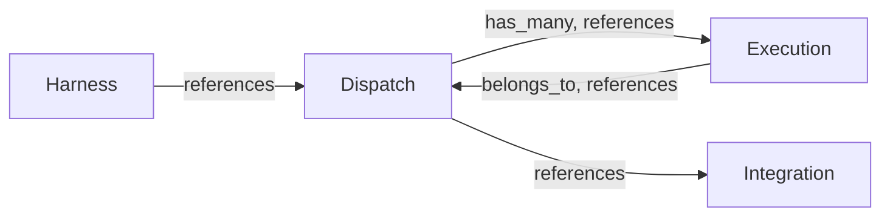
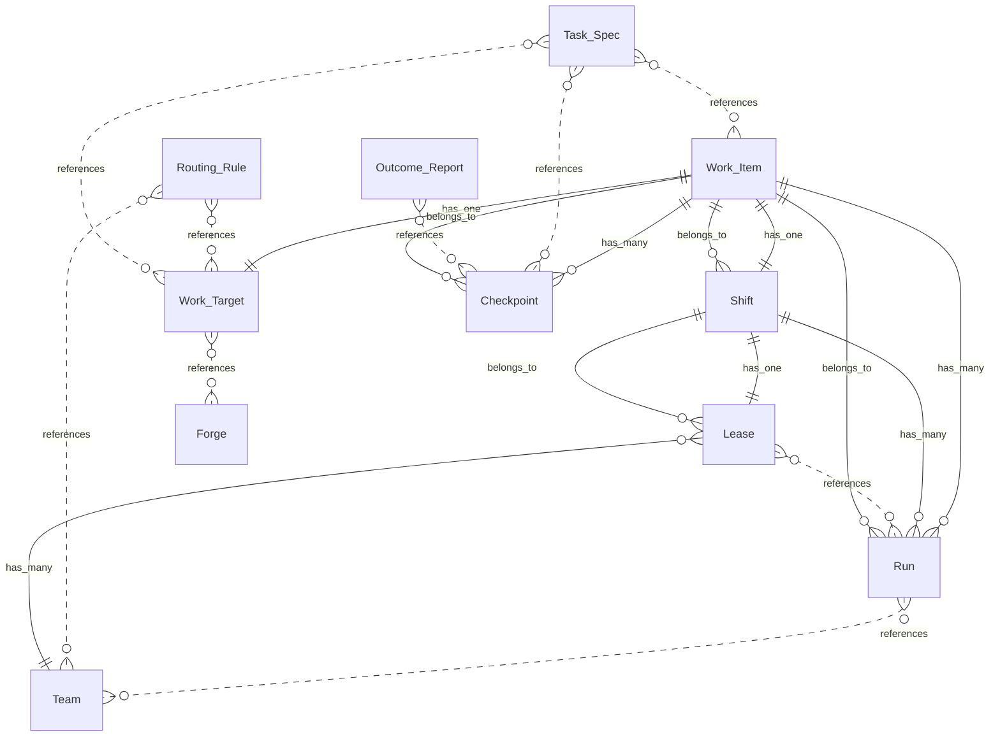

# Ploeg — Domain Overview

Ploeg is a dispatch plane: it turns work items from any tracker into ephemeral, leased, audited AI-agent runs on Kubernetes. The tracker stays the source of truth for WHAT to do; Ploeg owns HOW work gets executed — assignment events in, ephemeral runs out. (Ploeg is Dutch for a work crew or shift.)

*Model version 0.2.0. Generated from `model.yaml` — do not edit by hand.*

## Bounded contexts

- **Dispatch** — Core semantics owned by ploegd and Postgres: work items, leases, queues, checkpoints, outcomes, audit. Provider- and runtime-agnostic by rule.
- **Integration** — The provider SPI boundary: tracker and forge adapters, webhook parsing, normalized events, write-backs. Everything vendor-specific lives here.
- **Execution** — How runs happen on Kubernetes: the executor, jobs, watches, security posture. KEDA is the default implementation, not part of the language.
- **Harness** — The contract between Ploeg and an agent container: Task Spec in, Outcome Report out. Isolates the fast-churning agent-tool boundary.

## Context map

Arrows point from the context that holds the reference to the context it references.

## ⚠ Open ambiguities

These terms are contested or vague. Resolve them before writing specs that depend on them.

- **the "leased" Work Item state** — The Work Item state enum calls the working state `leased`, named for the Lease it used to imply. After ADR-0010 a Work Item in that state has a Shift, and may have no Lease at all — a Round of readers takes none. The state name now describes the wrong thing.
  - Options: Keep `leased` and accept the vocabulary drift, Rename to `active`, Rename to `in_shift`
  - Recommendation: Decide with the implementing change, not before. The rename touches the state enum, an applied migration, both contract schemas and the KEDA scaler query, so it is a real cost to weigh against a name that is merely imprecise. `active` reads best if it goes ahead.
- **when a Shift closes** — ADR-0010 introduces the Shift but leaves its terminal rule to the implementation. A Shift plainly closes on a terminal Outcome; less plainly when an item goes needs_human and a human re-queues it — does the old Shift resume with its remaining budget and Round counter, or does a fresh one open?
  - Options: Re-queue always opens a new Shift (budget resets, rounds restart), Re-queue resumes the existing Shift (budget and rounds carry over), Human chooses per re-queue
  - Recommendation: Resume the existing Shift. A re-queue after needs_human is usually a human unblocking work already done, and restarting the budget silently doubles what the item may cost. Confirm against the first real needs_human Shift.
- **follow-up mirroring** — Follow-Ups enter at queued with no Tracker Item, which tensions with "the tracker is the source of truth for what to do" — work now exists that the board cannot see.
  - Options: Keep Follow-Ups tracker-invisible (current), Asynchronously write a Tracker Item back for every Follow-Up, Write back only Follow-Ups that survive longer than one Run
  - Recommendation: Revisit in roadmap phase 2 (PR-feedback ingestion); async write-back is the likely answer so the board regains full visibility without blocking dispatch.
- **groomer run** — The design says Ploeg "can schedule a groomer run" but grooming semantics belong to the operator — it is unclear whether Groomer is Ploeg vocabulary at all, and what distinguishes a groomer run from a normal Run.
  - Options: Keep Groomer out of the core language (operator concern), Define it as a Team with a single grooming Role, First-class GroomerRun concept
  - Recommendation: Keep it out of the core language for now; if it lands in phase 2, model it as an ordinary Team whose single Role grooms — no new concepts.

## Entity relationships

## Contents

- [Glossary](glossary.md)
- [Entities](entities.md)
- [Business rules](rules.md)
- [Domain events](events.md)
